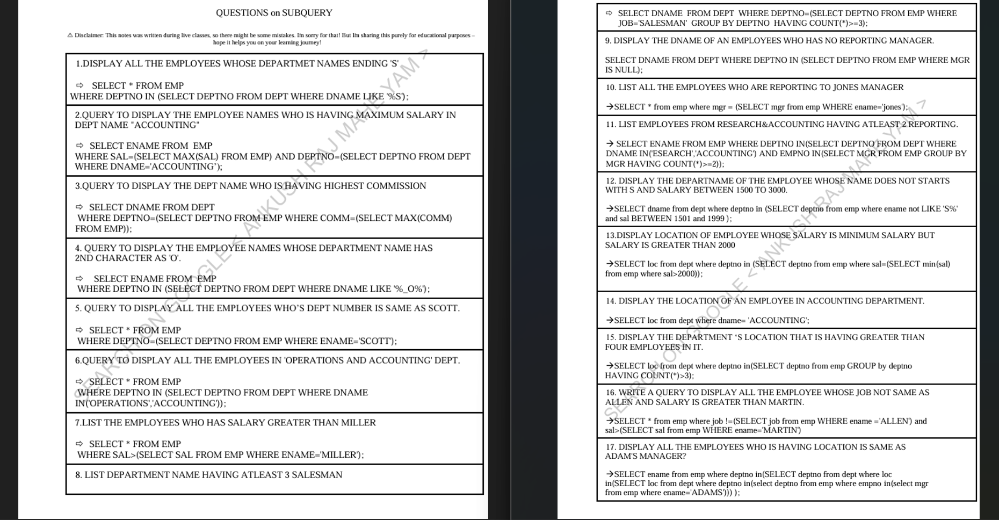

# Top Interview SQL Questions: By Ankush Raj  

### **Repository Description:**  
This repository contains a comprehensive collection of **Top SQL Interview Questions**, carefully designed to help you prepare and excel in SQL interviews. All queries have been authored by **Ankush Raj** (or **Ankush Raj Mahe Yam**).  

For a downloadable PDF of these queries, visit my LinkedIn page via the link provided below.

---

## Repository Structure  

The Questions are organized into folders, each focusing on specific SQL topics and concepts. Future Questions will follow the same structure and will be added incrementally.  

### Folder Structure  

```
SQL-Top-Interview-Questions/  
    ├── SubQuery.sql    
    └── (Future Questions will be added in separate file_names)  
```  

### Example Questions  

#### Sub_Query_Questions  

```
/*
DISPLAY ALL THE EMPLOYEES WHOSE DEPARTMENT NAMES ENDING 'S'.
*/

SELECT *
FROM EMP
WHERE DEPTNO IN (SELECT DEPTNO
                        FROM DEPT
                            WHERE DNAME LIKE '%S');

```


---

## Topics Covered in Questions  

1️⃣ **Subqueries**  
   - Nested Queries, Single-row, and Multi-row Subqueries.  

.
.
.
.
.
Future Questions will be added in same ways....

---

## How to Use  

1. Clone the repository:  
   ```bash  
   git clone https://github.com/AnkushRajMaheYam/SQL-Top-Interview-Questions.git  
   ```  

2. Execute the `.sql` file in your preferred database environment (e.g., MySQL, Oracle, or SQL Server).  

---

## LinkedIn Post  

Check out the full pdf that inspired these questions:  

👉 [SQL-Top-Interview-Questions by Ankush Raj Mahe Yam](https://www.linkedin.com/posts/ankushrajmaheyam_mastering-sql-subqueries-115-questions-activity-7253720042729558016-Olmw?utm_source=share&utm_medium=member_desktop)  


---

## About Me  

Hi, I’m **Ankush Raj or Ankush Raj Mahe Yam (ARMY)**, an aspiring software developer currently pursuing Java Full Stack Development. I’m passionate about coding and enjoy sharing my learning journey to help others grow.  

🌟 Connect with me:  
- **Google Search:** [Ankush Raj Mahe Yam](https://www.google.com/search?q=ankush+raj+mahe+yam)  
- **LinkedIn:** [Ankush Raj](https://linkedin.com/in/ankushrajmaheyam)  
- **GitHub:** [Ankush Raj](https://github.com/AnkushRajMaheYam)  
- **Leetcode:** [Ankush Raj](https://leetcode.com/u/AnkushRajMaheYam/)
- **Instagram:** [@AnkushRajaMaheYam](https://instagram.com/AnkushRajaMaheYam)  
- **Facebook:** [Ankush Raj](https://facebook.com/AnkushRajMaheYam)  
- **Fiverr:** [@AnkushRajMaheYa](https://www.fiverr.com/ankushrajmaheya)  
- **Upwork:** [Ankush Raj](https://www.upwork.com/freelancers/~01bf6d1e8483199ba6)  


---

## Disclaimer  

They are intended **purely for educational purposes**.  

---

**License:**  
This repository is licensed under the MIT License.  

---  

## **Acknowledgements**
Special thanks to the mentor(**Akash Sir**) and faculty at **J-Spider Software Training Institute (Noida Branch)** for providing excellent guidance and support throughout the course.

Feel free to explore, practice, and enhance your SQL skills! 😊  
Happy practicing SQL! 🎉  
